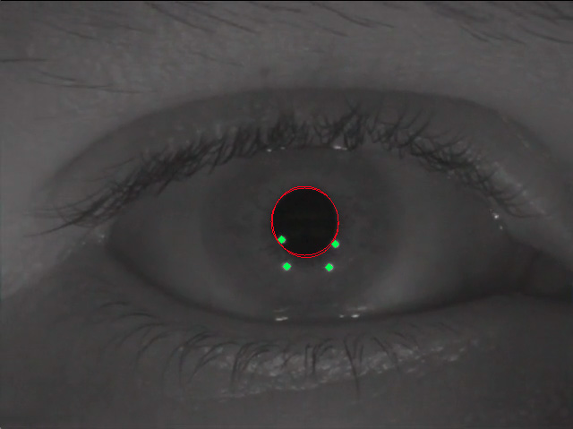
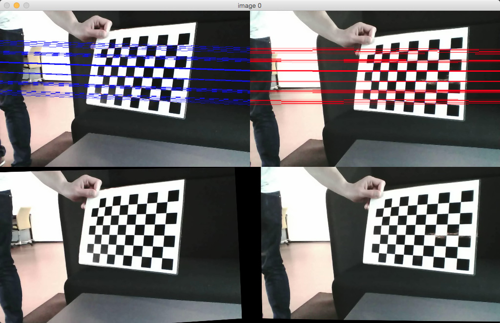

Graphics And Vision
===================

Student project Spring 2015 - [IT University of Copenhagen](www.itu.dk/en)

* Eye-Tracking-System: Basic image analysis and image processing pipeline for eye tracking
* Projective-Geometry: Projective geometry with homography
* Stereo-Vision-System: Basic stereo vision system and epipolar geometry

##Note
This project explored the different techniques used to implement experimental computer graphics and computer vision systems. While the implementation is satisfying in an academic context, it is nevertheless not suitable for deployment in a real-life context because of performance issues (algorithmic optimization was not part of the scope of this project).

